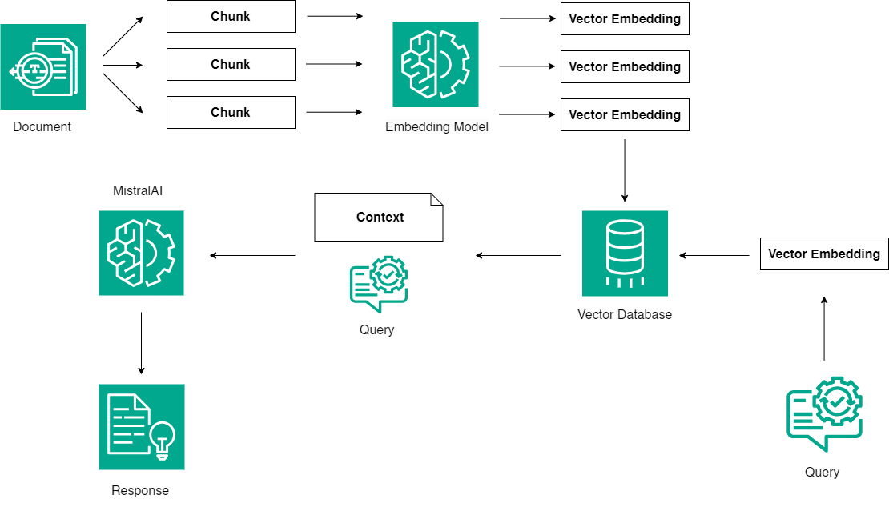

# Retrieval Augmented Generation (RAG) Application using Mistral3

This repository demonstrates the deployment of a Large Language Model (LLM) with a Retrieval Augmented Generation (RAG) approach. It explains how RAG enhances traditional LLM capabilities by integrating external data for more accurate and contextually relevant responses.

## Overview
RAG combines the strengths of retrieval systems and generative models to provide accurate and dynamic answers. Instead of relying solely on pre-trained knowledge, RAG retrieves relevant external information during inference to enrich its responses. This approach is particularly useful for applications requiring up-to-date or domain-specific knowledge.

## Features
- **Enhanced Text Generation**: Combines database retrieval with advanced language modeling.
- **Practical Examples**: Includes examples to demonstrate the workflow.
- **Scalability**: Designed to handle large datasets for retrieval tasks.

##  Retrieval Augmented Generation (RAG) Architecture


## Prerequisites
To use this repository, ensure the following are installed:
- Python (>=3.8)
- Notebook runtime environment (e.g., Jupyter Notebook)
- HuggingFace Access Token ( Can be acquired [here](https://huggingface.co/settings/tokens)
)

## Installation
1. Clone this repository:
   ```bash
   git clone https://github.com/barkiayoub/RAG_Application_using_Mistral3.git
   cd RAG_Application_using_Mistral3
   ```
2. Launch Jupyter Notebook:
   ```bash
   jupyter notebook
   ```

3. Open `RAG_Application_using_Mistral3.ipynb` to get started.

## Usage
1. Load the notebook and follow the step-by-step instructions provided.
2. Customize the retrieval and generation pipeline according to your dataset or use case.
3. Run the cells to execute the RAG workflow.

## Example Use Cases
- Domain-specific knowledge retrieval
- Research and analysis tools

## Contributing
Contributions are welcome! Please fork the repository and submit a pull request with your improvements.

## License
This project is licensed under the MIT License. See the `LICENSE` file for details.

## Acknowledgments
- **Mistral AI**: For the powerful language modeling framework.
- **Community**: For their continued support and contributions.

